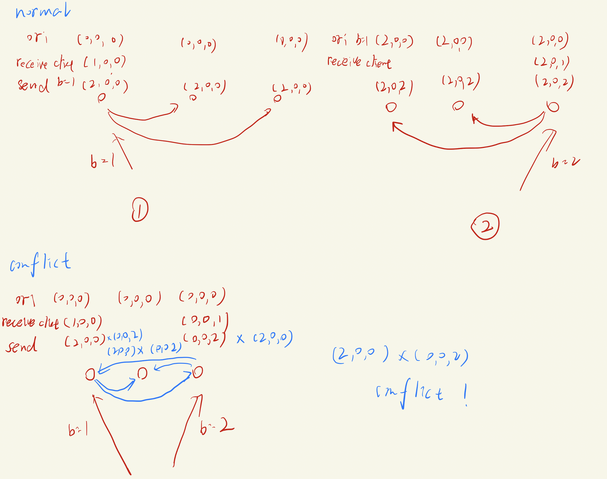

# Project 1: Group RPC Communication report

name: Shixiang Long

Student id: 4445538

## 1.Design of functional data structure

### 1) server

(1) we need a map to store the key and value

since conflicts may happens, so we need a array to store the values

```
kayValue = MAP {key, []int} 
```

(2) we need a map tp store the key and vector clock

```
keyVector = MAP {key, [][]int}
```

(5) server struct

```go
type Server struct {
	mu           sync.Mutex
  IsClient  	 bool
  kayValue		 MAP {key, []int} 
  keyVector		 MAP {key, [][]int}
  myVector		 []int
}
```

### 2) client

client class

```go
type Client struct {
	serversIpPort []string
}
```

## 2. Design of RPC and RPC's data structure

In communication, there is only one RPC. Client send the message to server ① retrieve the data ② update the value of specific key

### 1) client -> server

(1) When a client send a message to the group, the server should store it

```go
Operation RPC

Arguments:
  Operation int 	 // 0 means update, 1 means retrieve data
  key 		  string	
  value			string // if Operation == 1, value = ""	
  vector    []int
  
return value:
  Operation int    // 0 means update, 1 means retrieve data
  dataVector			 [][]string // retrieved value
  dataValue				 [][]int // retrieved vector
```


### 3) Defaul RPC port

For server: 1230 ~ 1235

For client：1220~1230

## 3. Pseudocode and logic

basic logic



Only if the server receive the new_update request, local_clock[myId] += 1

when  a server want to broadcast the data, local_clock[myId] += 1.

### 1) server:

```go
if receive  RPC:
	if request == new_update{
    if client send:
      local_clock[myId] += 1
    verify whether conflict between received clock and my clock
    if conflict:
      not rewrite the key value
      store the conflict value and received vector to corresponding key
    if not conflict:
      update my clock and rewrite the key value
    broadcast the message to all servers with (key, value, local clock)
  }
  if request == retrieve{
		return stored value and corresponding vector
  }
```

### 2) client

```
operations:
new key update the key
retrieve the data

set args.vector = {0,0...}
set operation key etc....
send the args to server:
if reply.data.length > 1: conflict
print(data)
```


## 4.Test design

### (1) No conflict

① open 0 ~ 3 servers, but not 4

② client new b = 1 on server 0

③ server 4 online

③ client update  b = 2 on server 1

④ client retrieve all of the value of b in each servers, print the corresponding key, value and vector

Sample log:

```
2022/03/11 08:57:22 client new b = 1 to server0, in this time, 0 ~ 3 are online, but 4 offline
2022/03/11 08:57:26 4 online now
2022/03/11 08:57:28 client update b = 2 to server0, in this time, 0 ~ 4 are online
2022/03/11 08:57:30 client retrieve all of the servers b = ?
2022/03/11 08:57:30 server0:
2022/03/11 08:57:30 the value:[2], the vecotor:[[2 2 0 0 0]] 
2022/03/11 08:57:30 server1:
2022/03/11 08:57:30 the value:[2], the vecotor:[[2 2 0 0 0]] 
2022/03/11 08:57:30 server2:
2022/03/11 08:57:30 the value:[2], the vecotor:[[2 2 0 0 0]] 
2022/03/11 08:57:30 server3:
2022/03/11 08:57:30 the value:[2], the vecotor:[[2 2 0 0 0]] 
2022/03/11 08:57:30 server4:
2022/03/11 08:57:30 the value:[2], the vecotor:[[2 2 0 0 0]] 
```

### (2)  conflict

①  open 0 ~ 4 (all) servers

② client new b = 1 on server 0    and  client new b = 2 on server 3

Sample log:

```
2022/03/11 09:01:04 client new b = 1 to server0, in this time, 0 ~ 3 are online, but 4 offline
2022/03/11 09:01:06 client update b = 1 to server0, and send b = 2 to server 4 simutaneously, 0 ~ 4 are online
2022/03/11 09:01:08 client retrieve all of the servers b = ?
2022/03/11 09:01:08 server0:
2022/03/11 09:01:08 the value:[1 2], the vecotor:[[2 0 0 0 0] [0 0 0 2 0]] 
2022/03/11 09:01:08 conflict happens !!!!!
2022/03/11 09:01:08 server1:
2022/03/11 09:01:08 the value:[1 2], the vecotor:[[2 0 0 0 0] [0 0 0 2 0]] 
2022/03/11 09:01:08 conflict happens !!!!!
2022/03/11 09:01:08 server2:
2022/03/11 09:01:08 the value:[1 2], the vecotor:[[2 0 0 0 0] [0 0 0 2 0]] 
2022/03/11 09:01:08 conflict happens !!!!!
2022/03/11 09:01:08 server3:
2022/03/11 09:01:08 the value:[2 1], the vecotor:[[0 0 0 2 0] [2 0 0 0 0]] 
2022/03/11 09:01:08 conflict happens !!!!!
2022/03/11 09:01:08 server4:
2022/03/11 09:01:08 the value:[2 1], the vecotor:[[0 0 0 2 0] [2 0 0 0 0]] 
2022/03/11 09:01:08 conflict happens !!!!!
```
