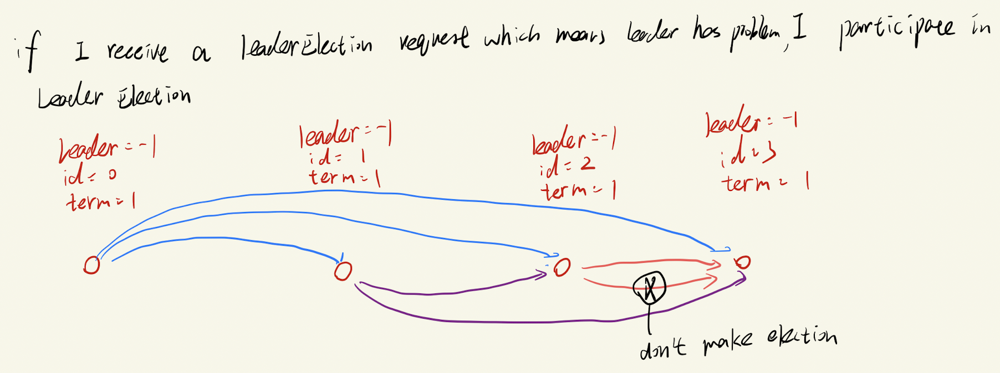

# Project 3: Quorum

name: Shixiang Long

Student id: 4445538

## 1.Design of leader election

#### 1.1 algorithm design


However, there is a problem. 

If the 1th node make a election, the nth node would receive `(n - 1)` leader election. Like the 2th node, it send make 2 times leader election because of the leader election message from 0th and 1th. In this case, the time complexity is not O(n ^ 2)

But O(n ^ 3)

**Optimization:**

In order to optimize it, we should introduce a new variable, term, which represent the times one node make the election.

Every time one node make a election, the node should `myterm++`

In this case, 

if one node receive the message's term <= myterm, I would not make the election, but just reply `isok`.

Else: myterm = message's term and make the election

To illustrate:



The node2 would make leader election twice because of the leader election message from node0 and node1. However, when node2 received the node0's message, its term 0->1, so when node1's message come, the node2 find that myterm >= node1's term, it would node make a new leader election.

#### 1.2 datastructure and Pseudocode

(1) we need a state the distinguish wether the node is the leader or not. Besides, every node should know who is the leader.

```go
MyId  	int // store my id 0 ~ len(nodes) - 1
State int   //0 leader, 1 normal server
Leader int  // 0 ~ len(nodes) - 1, initial value = -1
Myterm int		// initial: 0
```


(2) message structure

```go
leaderElection RPC

Arguments:
	SenderId int     // sender's id
  Type	   int		 // 0 means I want to make election, 1 means I successfully become the leader
  SenderTerm	int
return value:
	IsOk		 bool				 // only for leader election message, if my id > senderId, send ok = true, else false

```


(3) Pseudocode

```go
When client try to read or update one message and find leader == -1 or cant contact leader
if leader == -1 or cant contact leader: // there is no leader, start leader election  
  myTerm++
  leaderElection()

// LeaderElection part
LeaderElection():
  for i in servers: // send leaderElection MSG to every server 
    if i == myId: continue
  ret = send(leaderElection MSG
    if ret.isok == True: # means some one larger than me, finish leader election
       return
  // havent' received any isok == true, which means no one larger than me, I am win
  for i in servers: // send leaderElection MSG to every server 
    if i == myId: continue
    ret = send(I am won MSG)
 
// rpc message handler
LeaderElectionHandler(argument, returnValue):

 if argument.type == 1: // some one win in the leaderElection
  	leader = argument.senderId
		returnValue.isOk = false
    return
 else: // some one want to make leader election
  if argument.senderId > myId:
		returnValue.isok = True
  else:
    returnValue.isok = True
         
  if argument.SenderTerm > Myterm:      
      MyTerm = argument.SenderTerm
      make leaderElection()
```

## 2.Design for Write and Read

#### 2.1 algorithm design

Assuming there are five nodes, since `Nr + Nw > N` , Nw >= (N/2) + 1

Therefore, I set Nw = 3, Nr = 3

##### 2.1.1 Write


##### 2.1.2 read

The read algorithm is simpler. 

 A client can connect to any replica to read the value. The replica will randomly select NR replicas and request for values. We need Nr servers has the same value and return it to the client

Foe example, there are three times read value of `b`

|      | Server1 | Server2 | Server3 | Server4 | Server5 |
| ---- | ------- | ------- | ------- | ------- | ------- |
| 1    | 1       | 1       | 1       |         |         |
| 2    |         |         | 2       | 2       | 2       |
| 3    |         | 3       | 3       | 3       |         |


#### 2.2 datastructure and Pseudocode

(1) Nr and Nw set

Assuming there are 5 servers, N = 5, 2Nw > N, Nw + Nr > N

```
Nr = 3
Nw = 3
```

Since the replicas need the commit to apply the operation. It need to remember the uncommited operations.

```go
uncommited map[string][]string // the commited operation
```

Then the receivers would reply the leader "I am ready"

When leader receieve `Rw` "I am ready" The leader would send store the data and then, send commit to all of the servers. Then other replicas would apply the uncommited data, and delete the data from uncommited structure.

(2) message structure

```go
type OperationArgs struct {
	Operation int  // 0 means update or new, 1 means retrieve data
  isLeader	bool // wether the message sent by leader
	Key       string
	Value     string
	isCommit  bool
}

type OperationReply struct {
	Operation  int // 0 means update or new, 1 means retrieve data
  IsReady		 bool
}
```


(3) Pseudocode for server

 ```python
 OperationHandler(args *OperationArgs, reply *OperationReply):
   # if the operation is read
   if operation is read:
     for loop forever:
       Flood all of the servers and try to get Nr same value
       if find the value: return
   # remain part is write operation
   if leader is not responsive: make election()
   if I am not leader and isLeader == False:
     forward the request to leader
   	return
   # the later part is update or read operation
   if I am leader:
   	send to all the replicas msg with (isCommit = False)
   	if leader receive Nw IsReady:
     send to all the replicas msg with (isCommit = True)  
   if I am not leader:
 		if args.isCommit == False: uncommited.add(key,value)
       reply.IsReady = True
    	if args.isCommit == True:
       keyValue[key] = args.Value
       delete key in uncommited 
       return 
 ```


## 3.Test design

1. Design a test to show that your system only commits changes when quorum is achieved. 

2. Design a test to show read works as intended.

The process

**write part**

① open server 0 ~ 4

② client new b = 1 on server 0

③ since there is no leader, server0 start leader election send the msg to 1 ~ 4. And all the server who receive it also start election

④ server 4 win. Leader 0 forward the ②  to server4

⑤ leader send the b = 1 to all of the node with `IsCommit = false` 

⑥ All of the receiver store the b = 1 into uncommited data strucutre, which used to store the uncommited data. And return `I am ready` to leader

⑦ leader receive enough number of `I am ready`, which number > Nw, and send `commit` message

⑧ All of the receiver apply the b = 1

**read part(the read part based on write part):** 

① client try to search b on server 3

② server3 flooding the request

③ the receiver return their own value of b, if no b, reutrn ""

④ server3 get enough number `b = 1`, and return to client


Sample log containing server 0 ~ server 4 's log':

```
=== RUN   Test1
=====================I am client, try to write key of server 0 and key: b value: 1======================
=====================I am client, try to read key of server 4, key: b============================
=================== logs server0 ~ server 4 ======================
server0: ==================================
2022/03/27 11:27:04 rpc.Register: method "Proceed" has 1 input parameters; needs exactly three
2022/03/27 11:27:04 rpc.Register: method "ProceedTest" has 1 input parameters; needs exactly three
2022/03/27 11:27:05 I am 0 find my leader variable == -1, start leader election
2022/03/27 11:27:05 I am  0  try to make leader election
2022/03/27 11:27:05 Leader is  4
2022/03/27 11:27:05 I am: 0 stored the b 1 into uncommit datastructure
2022/03/27 11:27:05 I am: 0 get the commit instruction and apply key = b and value 1
2022/03/27 11:27:07 I am 0 get the read request from another and return 1
server1: ==================================
2022/03/27 11:27:04 rpc.Register: method "Proceed" has 1 input parameters; needs exactly three
2022/03/27 11:27:04 rpc.Register: method "ProceedTest" has 1 input parameters; needs exactly three
2022/03/27 11:27:05 I am  1 , receive  0 's leader election message, so participate the leader election
2022/03/27 11:27:05 I am  1  try to make leader election
2022/03/27 11:27:05 Leader is  4
2022/03/27 11:27:05 I am: 1 stored the b 1 into uncommit datastructure
2022/03/27 11:27:05 I am: 1 get the commit instruction and apply key = b and value 1
2022/03/27 11:27:07 I am 1 get the read request from another and return 1
server2: ==================================
2022/03/27 11:27:04 rpc.Register: method "Proceed" has 1 input parameters; needs exactly three
2022/03/27 11:27:04 rpc.Register: method "ProceedTest" has 1 input parameters; needs exactly three
2022/03/27 11:27:05 I am  2 , receive  1 's leader election message, so participate the leader election
2022/03/27 11:27:05 I am  2  try to make leader election
2022/03/27 11:27:05 Leader is  4
2022/03/27 11:27:05 I am: 2 stored the b 1 into uncommit datastructure
2022/03/27 11:27:05 I am: 2 get the commit instruction and apply key = b and value 1
2022/03/27 11:27:07 I am 2 get the read request from another and return 1
server3: ==================================
2022/03/27 11:27:04 rpc.Register: method "Proceed" has 1 input parameters; needs exactly three
2022/03/27 11:27:04 rpc.Register: method "ProceedTest" has 1 input parameters; needs exactly three
2022/03/27 11:27:05 I am  3 , receive  2 's leader election message, so participate the leader election
2022/03/27 11:27:05 I am  3  try to make leader election
2022/03/27 11:27:05 Leader is  4
2022/03/27 11:27:05 I am: 3 stored the b 1 into uncommit datastructure
2022/03/27 11:27:05 I am: 3 get the commit instruction and apply key = b and value 1
2022/03/27 11:27:07 I am 3,read data from other replicas and the number of 3 > Nr(3) and return it to the client
server4: ==================================
2022/03/27 11:27:04 rpc.Register: method "Proceed" has 1 input parameters; needs exactly three
2022/03/27 11:27:04 rpc.Register: method "ProceedTest" has 1 input parameters; needs exactly three
2022/03/27 11:27:05 I am  4 , receive  3 's leader election message, so participate the leader election
2022/03/27 11:27:05 I am  4  try to make leader election
2022/03/27 11:27:05 I am leader, I am  4
2022/03/27 11:27:05 I am leader: 4 try to get quorum 
2022/03/27 11:27:05 I am leader: 4 , I have already get quorum and try to send commit
2022/03/27 11:27:07 I am 4 get the read request from another and return 1
```

You could see

1.Leader4 wins

2.write:  I am leader: 4 try to get quorum , I am leader: 4 , I have already get quorum and try to send commit.

3.read:  I am 3,read data from other replicas and the number of 3 > Nr(3) and return it to the client

## 4.system's pros and cons

Pro: Implement basic distributed key value store. 

Cons: This system use bully algorithm, so it can't tolerate network failure. Besids, I haven't implement the recovery protocol.
